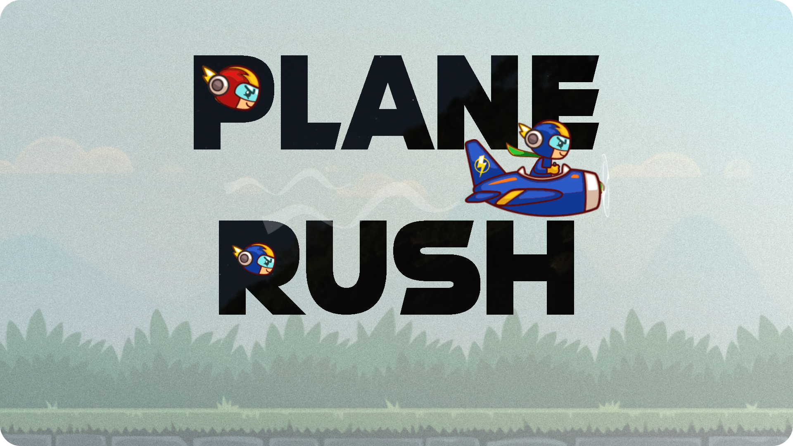

# Plane Rush



> Plane Rush is a game based on NFTs that runs on the `POLYGON` network in the `ETHEREUM` blockchain and is powered by decentralized `Chainlink` Oracles.

<h6>Built at the Chainlink Hackathon 2021</h6>

## 🤔 What is Plane Rush?

✔️ It is an NFT based game that runs on `POLYGON` and is powered by decentralized `Chainlink` Oracles

✔️ We used `Alchemy` for the RPC URL Endpoint to serve the calls to the Blockchain for data from the frontend of the DApp.

✔️ All the NFTs are stored using `nft.storage` which stores the NFTs on `Filecoin` and `IPFS`

## 💻 Bounties that we have worked on


## ⬇️ About the game

✔️ The game involves a pilot driving a plane moves through the accelerating obstacles coming towards him. The NFT here is the Pilot and the Plane combined. 

✔️ The Pilot can move in any direction(up, left, right or down) to pass through these obstacles and gets 10 points whenever he successfully moves through each one of them. The game ends whenever the Pilot hits an obstacle.

✔️ Every Plane has an `Airspeed` that represents how fast it can move through those obstacles. The NFTs that have higher Airspeeds will be able to perform better with respect to the obstacles as they keep accelerating forever. This is the incentive model for the users to buy the Planes with a better `Airspeed`.


✔️ Users will be rewarded with new Randomized characters which have a speed corresponding to the score achieved in the game with a certain amount of randomization to it whenever the user achieves a new checkpoint. The NFTs are generated in the backend and the images of these NFTs are completely Random.

✔️ `Chainlink` is used to bring in the NFT's metadata on-chain through its API calls. Thus, the NFTs can be dynamic and randomized just by calling a smart contract function from the frontend of the DApp

### 🤔 How are the Random NFT images generated?


There are several different images for each of the 5 components and they are combined randomly to generate a Random NFT

✔️ Visit the [Plane-Rush-API](https://github.com/DineshBS44/RandomizeNFT) github repo https://github.com/DineshBS44/RandomizeNFT to know more about the Random Character Image generation and usage of `nft.storage` which stores the NFTs on `Filecoin` and `IPFS`
<br /> <br />

<br>

✔️ `ChainlinkClient` contract is used to create a Request for calling the API to get metadata for the NFT such as name, image and Airspeed. The Chainlink oracle used for making GET request from the API is [Linkriver](https://linkriver.io/)
<br>


✔️ The metadata for the NFT is stored in `FlieCoin` and `IPFS` using `nft.storage` using the [Plane-Rush-API](https://github.com/DineshBS44/RandomizeNFT) and it returns the IPFS Hash to the smart contract using Chainlink Oracles.
<br>

<br>

✔️ The DApp(Decentralized Application) which includes the Game is deployed to the `Polygon Mumbai Testnet`
✔️ The website also has its own NFT Marketplace for the users to buy and sell NFTs that are used to play the game.

## ⬇️ Working Demo of our DApp

The Application's frontend is deployed to https://planerush.netlify.app/ using `Netlify`. Make sure you have Metamask installed in your browser and connect it to MATIC Mumbai Testnet using the Custom RPC option. Also, get some MATIC from the Faucet.

## 💻 PlaneRush contract

<a href="https://mumbai.polygonscan.com/address/0xCcA0ccA9a8F12c90a1aCB3c6612c91D06fA4CF75#contracts">Click here</a> to view the PlaneRush contract on Polygonscan Mumbai Testnet

The contract <a href="https://mumbai.polygonscan.com/address/0xCcA0ccA9a8F12c90a1aCB3c6612c91D06fA4CF75#code">code</a> has been verified and it is visible on `mumbai.polygonscan.com`

## ☑️ Built With

- [Chainlink](https://chain.link/) - Chainlink's decentralized oracle network provides reliable, tamper-proof data for complex smart contracts
- [Polygon](https://polygon.technology/) - Polygon is a protocol and a framework for building and connecting Ethereum-compatible blockchain networks and provides scalable solutions
- [Alchemy](https://docs.alchemy.com/alchemy/documentation/apis/polygon-api) - To access a node which connects with Ethereum Blockchain on the Polygon Mumbai Testnet
- [nft.storage](https://nft.storage/) - Free decentralized storage and bandwidth for NFTs on IPFS and Filecoin.
- [IPFS](https://ipfs.io/) - P2P network for storing and sharing files in a distributed file system
- [Filecoin](https://filecoin.io/) - A decentralized storage network to store humanity's most important information
- [Ethereum](https://www.ethereum.org/) - Ethereum is a decentralized platform that runs smart contracts
- [Solidity](https://docs.soliditylang.org/en/v0.8.6/) - The most popular language for writing smart contracts
- [Phaser](https://phaser.io/) - An open source framework for building browser based games
- [ReactJS](https://reactjs.org/) - A JavaScript library for building user interfaces
- [Truffle Framework](http://truffleframework.com/) - Truffle is the most popular development framework for Ethereum with a mission to make your life a whole lot easier
- [Remix - Solidity IDE](https://remix.ethereum.org/) - To compile, test and deploy faster using Javascript VM
- [Visual Studio Code](https://code.visualstudio.com/) - Code Editor
- [Ganache - One Click Blockchain](https://truffleframework.com/ganache) - Local blockchain for testing
- [Open Zeppelin ](https://openzeppelin.org/) - Open source Library of pre-built contracts
- [Metamask](https://metamask.io/) - Wallet Provider
- [Polygonscan](https://mumbai.polygonscan.com/) - View and keep track of transactions happening around a smart contract as well as view its code, read and write stuff to it
- [TailwindCSS](https://tailwindcss.com/) - A packed CSS framework to build beautiful websites faster

## ☑️ Getting Started

These instructions will get you a copy of the project up and running on your local machine for development and testing purposes.

### ☑️ Prerequisites

Please make sure you've already installed NPM & Yarn packages, Truffle and enabled MetaMask extension in your browser.

If you don't have `yarn` installed, run the following command:

```
npm install -g yarn
```

If you don't have Truffle installed, run the following command:

```
npm install -g truffle
```

Please make sure that the Metamask wallet is connected to the `Polygon Mumbai Testnet` and has some MATIC tokens.

### ☑️ Installing

A step by step guide to locally run the DApp

- First, get free API keys from [Alchemy](https://docs.alchemy.com/alchemy/documentation/apis/polygon-api) and [Polygonscan](https://polygonscan.com/)
- Clone this repository:

```
git clone https://github.com/Hardikag17/Plane-Rush
```

- Install all the required packages using the following command

```
yarn
```

- Create a `.env` file and store the following contents in it and include API keys:

```
POLYGONSCAN_API_KEY="<Polygon API Key>"
MNEMONIC="<Enter your metamask seed phrase here>"
ALCHEMY_POLYGON_MUMBAI_RPC_URL="https://polygon-mumbai.g.alchemy.com/v2/<Alchemy API Key>"
```

- To launch the DApp, use the following command:

```
yarn start
```

## ⬇️ Libraries/services used

- **@truffle/hdwallet-provider** - Used to create a provider using Seed phrase(Mnemonic) and Alchemy RPC URL to connect to the Blockchain
- **web3** - To interact with the deployed smart contract on Polygon Mumbai Testnet
- **@chainlink/contracts** - To inherit ChainlinkClient contract to call an API using the decentralized Chainlink Oracles
- **@openzeppelin/contracts** - To inherit the ERC721 based contracts
- **phaser** - To build the game
- **react** - For creating the fronted DApp
- **tailwindcss** - A CSS framework to build beautiful websites faster
- **@ion-phaser/react** - React specific wrapper for ion-phaser component
- **truffle-plugin-verify** - To verify the smart contract code on Polygonscan using its API
- **dotenv** - For managing data in .env files
- **solc** - For compiling solidity contracts
- **ganache-cli** - For running a local blockchain mostly used for testing purposes
- **mocha & chai** - To test the smart contracts written in solidity
- **solhint** - To lint solidity files
- **prettier & prettier-plugin-solidity** - To format the code

### ⬇️ Some versions of Frameworks and Libraries used in this project are

- **Truffle version** - 5.3.14
- **Solidity version** - 0.6.6
- **Node JS version** - 14.16.1
- **@truffle/hdwallet-provider version** - 1.4.1
- **web3 version** - 1.4.0

## 🙌 Developers

- **Dinesh B S** [(@DineshBS44)](https://github.com/DineshBS44)
- **Hardik Agarwal** [(@Hardikag17)](https://github.com/Hardikag17)
- **Suryashankar Das** [(@iamsdas)](https://github.com/iamsdas)

## ☑️ License

Licensed under MIT License : https://opensource.org/licenses/MIT

<br>
<br>